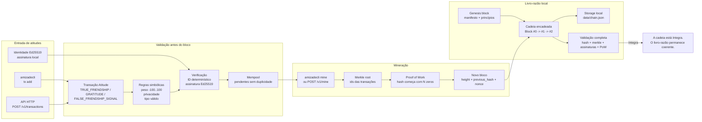
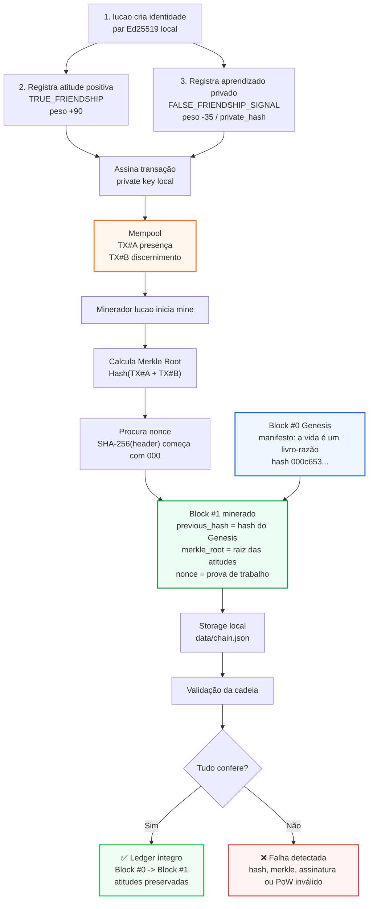

# AmizadeChain — A Vida é um Livro-Razão

> A vida é um livro-razão. Toda atitude vira lançamento.

A **AmizadeChain** é uma blockchain educacional em Go, local-first, criada para estudar blocos, transações, hash SHA-256, Merkle root, Proof of Work, assinatura Ed25519, CLI, API HTTP e storage modular — com uma narrativa humana: amizade verdadeira é consenso entre palavras, presença e atitudes.

Não é criptomoeda financeira. A unidade simbólica é **ATT — Atitude**. Sinais de falsa amizade são tratados como aprendizado, limite e privacidade, nunca como exposição pública.

## Recursos

- Core blockchain sem dependência de CLI/API.
- Blocos, transações, hash canônico e Merkle root.
- Genesis simbólico carregável e validável.
- Proof of Work simples com dificuldade configurável.
- Transações assináveis com Ed25519.
- Mempool com rejeição de duplicidade.
- Storage em memória para testes e storage local JSON persistente.
- CLI `amizadecli`.
- Daemon/API `amizadechaind`.
- Testes para core, genesis, PoW, mempool, storage e API.

## Esquema da blockchain em funcionamento



### Blockchain em ação: blocos sendo formados



Exemplo visual da cadeia depois da mineração:

```text
┌────────────────────────────────────────────────────────────────────┐
│ Block #0 — Genesis                                                 │
│ hash: 000c653...                                                   │
│ prev: 0000000...                                                   │
│ txs : manifesto, princípios, amizade verdadeira, limites saudáveis │
└──────────────────────────────┬─────────────────────────────────────┘
                               │ previous_hash
                               ▼
┌────────────────────────────────────────────────────────────────────┐
│ Block #1 — Atitudes mineradas                                      │
│ hash: 000305b...                                                   │
│ prev: 000c653...                                                   │
│ merkle: raiz(TX presença + TX discernimento)                       │
│ txs : TRUE_FRIENDSHIP + FALSE_FRIENDSHIP_SIGNAL                    │
└──────────────────────────────┬─────────────────────────────────────┘
                               │ próximo bloco aponta para este hash
                               ▼
┌────────────────────────────────────────────────────────────────────┐
│ Block #2 — Próximas páginas do livro-razão                         │
│ hash: 000....                                                      │
│ prev: hash do Block #1                                             │
│ txs : gratidão, reparação, lealdade, novos limites                 │
└────────────────────────────────────────────────────────────────────┘
```

## Rodando

```bash
go test ./...
go run ./cmd/amizadecli init --genesis ./genesis.json --data-dir ./data
go run ./cmd/amizadecli identity new --name lucao --data-dir ./data
```

Criar transação assinada:

```bash
go run ./cmd/amizadecli tx add --data-dir ./data --signer lucao \
  --type TRUE_FRIENDSHIP --to "amigo-presente" \
  --attitude presenca --weight 90 \
  --message "Esteve presente quando ninguém estava vendo." \
  --tag presenca --tag lealdade
```

Sinal de falsa amizade sem exposição:

```bash
go run ./cmd/amizadecli tx add --data-dir ./data --signer lucao \
  --type FALSE_FRIENDSHIP_SIGNAL --to "hash:amizade-sem-exposicao" \
  --attitude discernimento --weight -35 --visibility private_hash \
  --message "Promessa repetida sem presença. Registro feito como aprendizado, não como exposição." \
  --tag falsa-amizade --tag limite --tag aprendizado
```

Minerar e validar:

```bash
go run ./cmd/amizadecli mine --data-dir ./data --miner lucao
go run ./cmd/amizadecli validate --data-dir ./data
```

Exportar:

```bash
go run ./cmd/amizadecli export --data-dir ./data --format json --out ./chain-export.json
```

## API HTTP

```bash
go run ./cmd/amizadechaind --http 127.0.0.1:8080 --data-dir ./data
```

Endpoints:

- `GET /health`
- `GET /v1/genesis`
- `GET /v1/chain`
- `GET /v1/blocks`
- `GET /v1/blocks/height/{height}`
- `GET /v1/blocks/hash/{hash}`
- `GET /v1/mempool`
- `POST /v1/transactions`
- `POST /v1/mine`
- `GET /v1/validate`
- `GET /v1/friendships/{id}/ledger`

Exemplo:

```bash
curl -X POST http://127.0.0.1:8080/v1/transactions \
  -H 'Content-Type: application/json' \
  -d '{"type":"TRUE_FRIENDSHIP","to":"amigo-leal","attitude":"lealdade","weight":95,"visibility":"public_symbolic","message":"Defendeu minha verdade quando eu não estava na sala.","tags":["lealdade","verdade"]}'

curl -X POST http://127.0.0.1:8080/v1/mine \
  -H 'Content-Type: application/json' -d '{"miner":"lucao"}'

curl http://127.0.0.1:8080/v1/validate
```

## Genesis

O genesis em `genesis.json` traz manifesto, princípios e o bloco zero.

- Hash esperado: `000c65374b8ff01ec664f5a0a1e6bfdd889a49903eb02dd43786a6f604e6a582`
- Merkle root: `ecffd77e454d7cba8b729ef61f5151a297ae69ff9bba346ca35eb708384234e6`
- Nonce: `7795`

O hash do header usa JSON canônico com chaves ordenadas.

## Estrutura

```text
cmd/amizadecli       CLI local
cmd/amizadechaind    daemon HTTP
internal/blockchain  domínio da cadeia
internal/consensus   Proof of Work
internal/genesis     loader/validador do genesis
internal/identity    Ed25519
internal/mempool     transações pendentes
internal/storage     memória e arquivo local
internal/service     orquestração do nó
internal/api         handlers HTTP
```

## Nota ética

Este projeto é educacional e simbólico. Não use para expor pessoas reais, criar acusações públicas ou alimentar conflitos. Falsa amizade aqui é registrada como padrão de aprendizado, com `private_hash` ou `public_symbolic_no_shame`.

## Licença

MIT.
